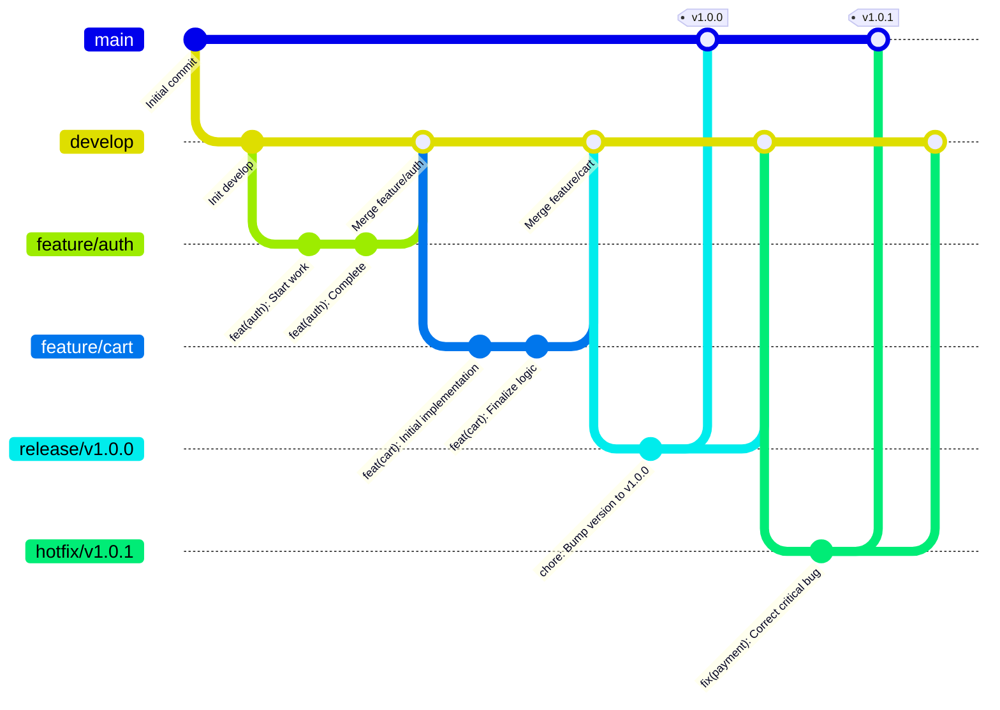
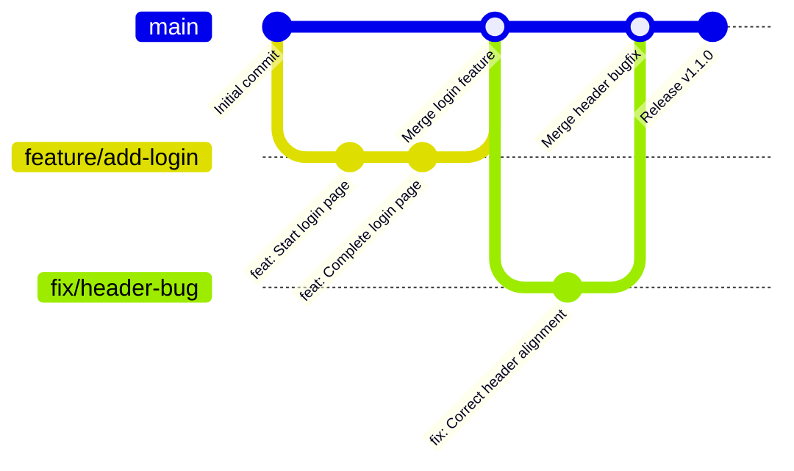

# Git Workflow and Commit Convention Guide

> A comprehensive guide to structuring Git workflows and standardizing commit messages, tailored for teams of different sizes and needs.

---

This guide is divided into two approaches. Choose the one that best fits your team's culture, project complexity, and collaboration style.

-   **[Part 1: For Large & Professional Teams](#part-1-for-large--professional-teams)**: A rigorous, structured approach ideal for large-scale projects requiring high traceability and automation.
-   **[Part 2: For Small Teams & Projects](#part-2-for-small-teams--projects)**: A lightweight, flexible approach designed for speed and simplicity in smaller collaborations.

---

## Part 1: For Large & Professional Teams

This approach prioritizes clarity, consistency, and automation. It is designed to make the commit history exceptionally readable and to integrate seamlessly with CI/CD pipelines for tasks like automated versioning and changelog generation.

### 1.1. Git Workflow: Structured Git Flow

We recommend a strict Git Flow model. This model isolates development, release preparation, and maintenance into distinct branch categories, preventing unstable code from entering the main codebase.

-   `main`: Contains production-ready code. Merges only from `release` or `hotfix` branches.
-   `develop`: The primary development branch, containing pre-production code with the latest features.
-   `feature/*`: Branched from `develop` for new feature development. Merged back into `develop`.
-   `release/*`: Branched from `develop` for release preparation (final testing, version bump). Merged into both `main` and `develop`.
-   `hotfix/*`: Branched from `main` to address critical production bugs. Merged into both `main` and `develop`.



### 1.2. Commit Convention: Conventional Commits (Strict)

Adhering to the **Conventional Commits** specification is mandatory.

#### **Structure**

```
<type>(<scope>): <subject>

[optional body]

[optional footer]
```

-   **Subject:** A concise (≤50 chars), imperative summary (e.g., `add` not `added`).
-   **Body:** Provides context, explaining the *what* and *why*.
-   **Footer:** References issues (`Closes #123`) or declares `BREAKING CHANGE`.

#### **Commit Types**

| Type       | Title                      | Purpose                                                        |
| :--------- | :------------------------- | :------------------------------------------------------------- |
| `feat`     | Features                   | A new feature for the user.                                    |
| `fix`      | Bug Fixes                  | A bug fix for the user.                                        |
| `docs`     | Documentation              | Changes to documentation only.                                 |
| `style`    | Styles                     | Code formatting changes (whitespace, semicolons, etc.).        |
| `refactor` | Code Refactoring           | A code change that neither fixes a bug nor adds a feature.     |
| `perf`     | Performance Improvements   | A code change that improves performance.                       |
| `test`     | Tests                      | Adding missing tests or correcting existing ones.              |
| `build`    | Build System               | Changes that affect the build system or external dependencies. |
| `ci`       | Continuous Integration     | Changes to CI configuration files and scripts.                 |
| `chore`    | Chores                     | Other changes that don't modify source or test files.          |

#### **Examples**

**New Feature with Scope:**
```
feat(api): add user profile endpoint
```

**Fix with Body and Footer:**
```
fix(auth): prevent infinite redirect loop on login

The previous logic did not correctly handle the case where a user was
already authenticated but was redirected to the login page, causing a
loop. This change introduces a check to redirect authenticated users
to the dashboard instead.

Closes #211
```

**Breaking Change:**
```
refactor(auth): consolidate user ID format to UUID

BREAKING CHANGE: The `user.id` property is now a string (UUIDv4)
instead of an integer. All downstream services must be updated to
handle the new format before deploying this change.
```

---

## Part 2: For Small Teams & Projects

This approach is a simplified version of the professional standard, designed to be easy to adopt while still providing significant benefits in history clarity. It favors speed and simplicity over rigid structure.

### 2.1. Git Workflow: Simplified Flow (GitHub Flow)

A simpler "GitHub Flow" is often sufficient. All work is done in feature branches created from `main`.

-   `main`: The primary branch. It should always be stable and deployable.
-   `feature/*` (or `fix/*`, `chore/*`, etc.): Branched from `main` for any new work. Once complete and tested, it's merged back into `main` via a Pull Request.



This model is straightforward and works well for projects that don't require complex release management.

### 2.2. Commit Convention: Conventional Commits (Lite)

Use a relaxed version of Conventional Commits, focusing on the `type` and `subject`.

#### **Structure**

```
<type>: <subject>
```

-   The `scope` is optional and can be omitted for simplicity.
-   The `body` and `footer` are only used for complex changes that require explanation.

#### **Core Commit Types**

Focus on a smaller, essential set of types:

| Type    | Title      | Purpose                                           |
| :------ | :--------- | :------------------------------------------------ |
| `feat`  | Features   | A new feature.                                    |
| `fix`   | Bug Fixes  | A bug fix.                                        |
| `docs`  | Docs       | Changes to documentation.                         |
| `chore` | Chores     | Maintenance tasks, dependency updates, etc.       |
| `refactor`| Refactor | Code restructuring without changing functionality.|

#### **Examples**

**New Feature:**
```
feat: add dark mode toggle
```

**Bug Fix:**
```
fix: correct layout shift on mobile devices
```

**Chore with explanation:**
```
chore: upgrade react to v18

Upgraded React and its related dependencies to the latest major version
to leverage new concurrent features.
```